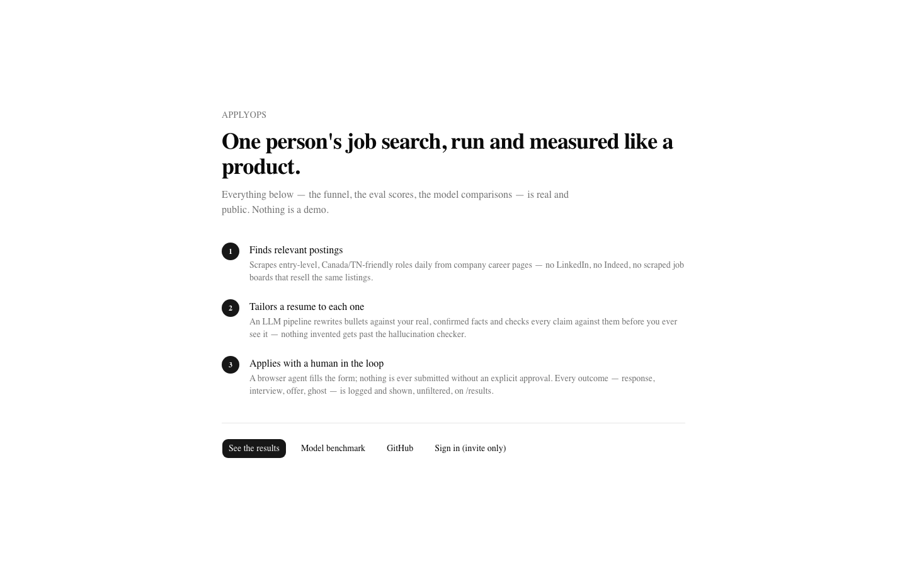
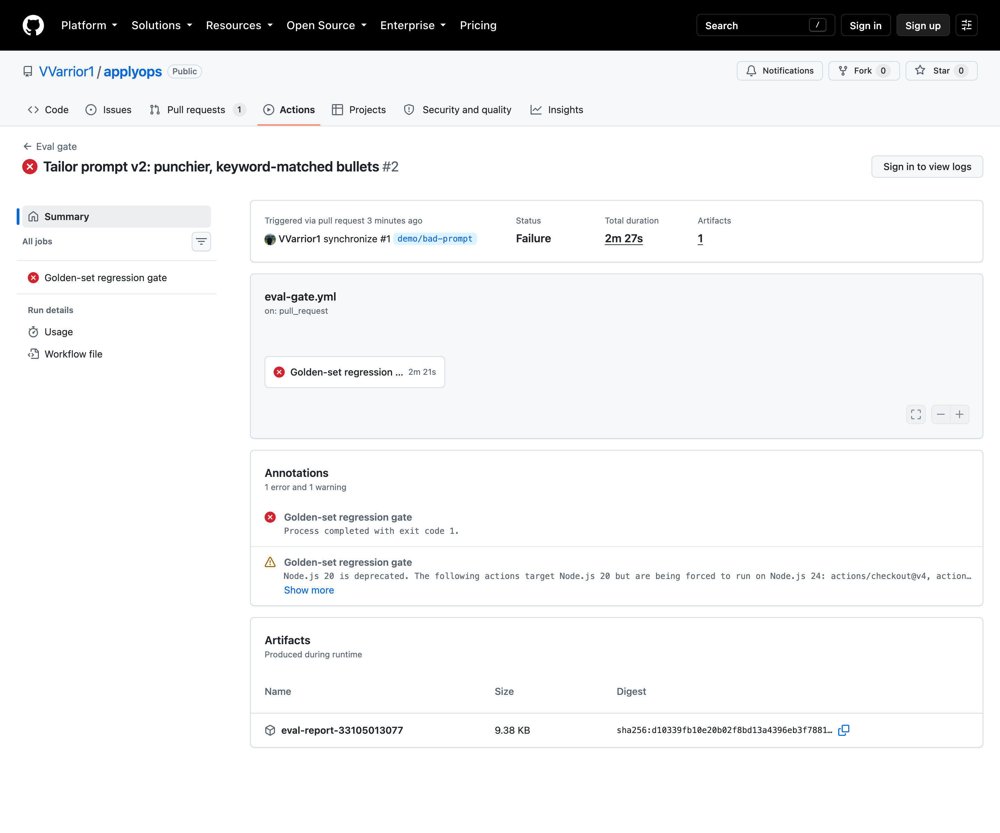
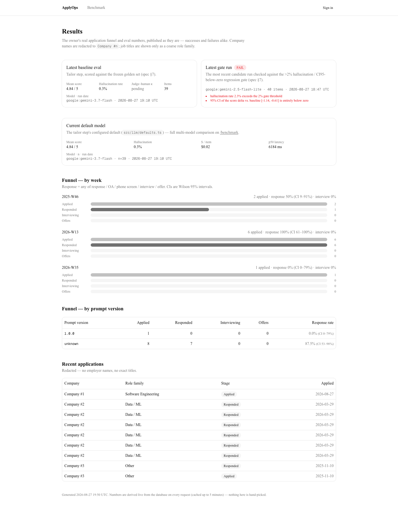
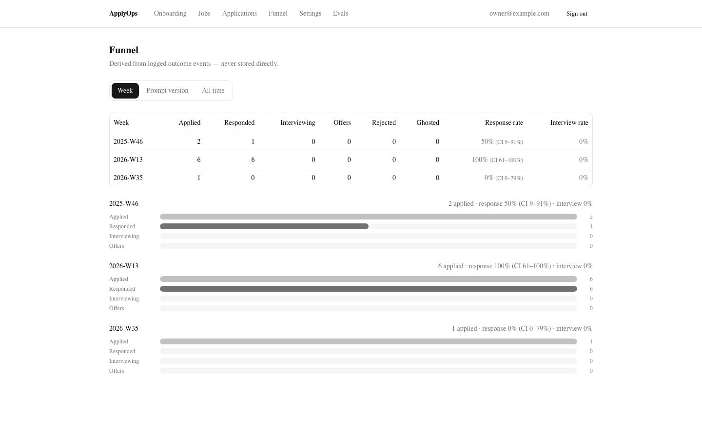
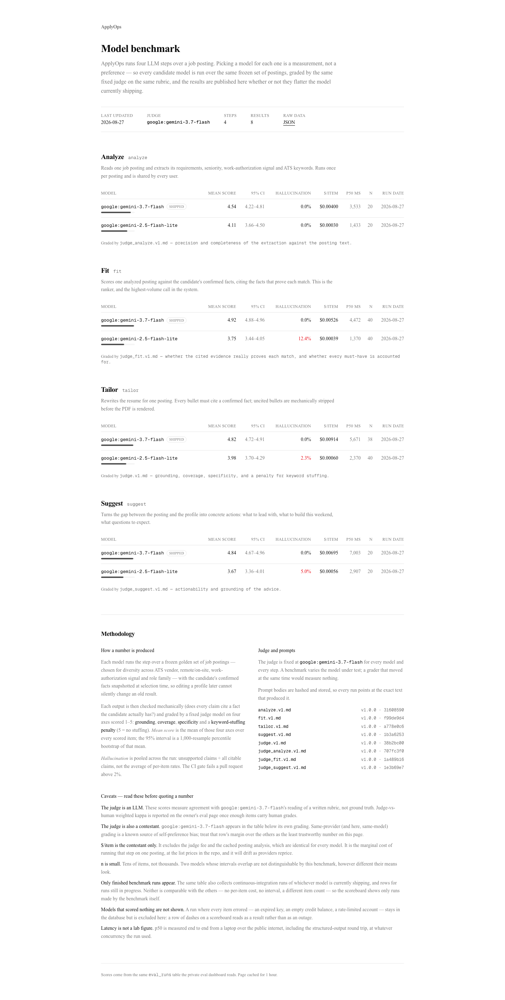
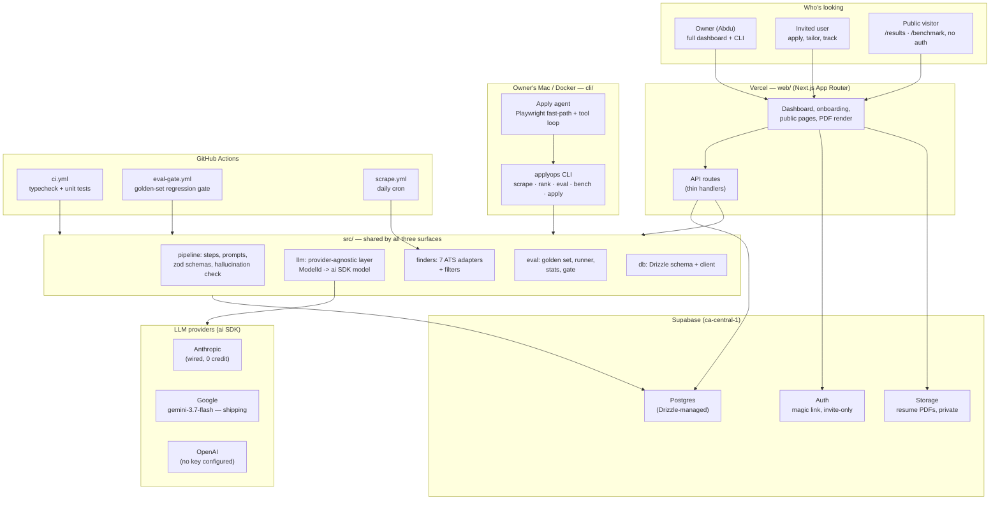
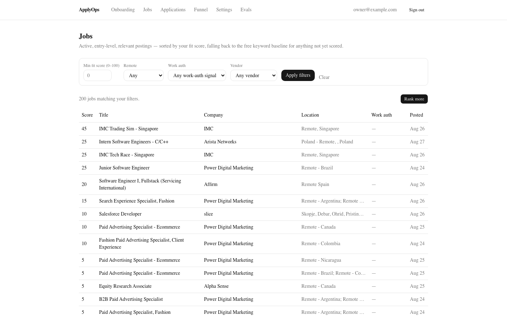
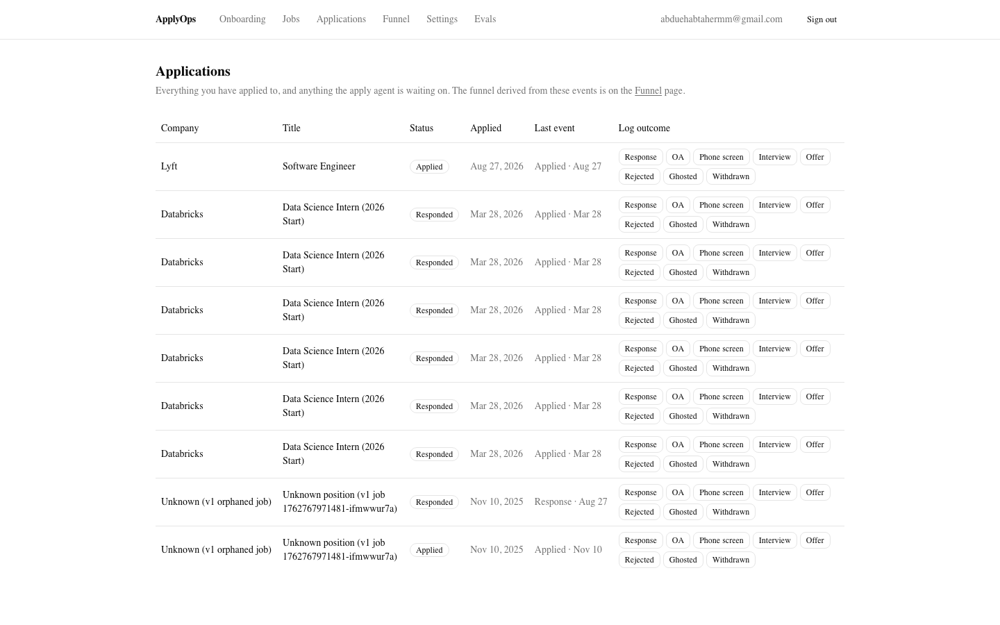

# ApplyOps

One person's job search, run and measured like a product. Every AI step is
fact-checked against the candidate's confirmed facts, a golden-set regression
gate blocks prompt/model changes that make the pipeline worse, and the
funnel + model benchmark are public — successes and failures alike.

**Live:** [applyops-two.vercel.app](https://applyops-two.vercel.app) · [`/results`](https://applyops-two.vercel.app/results) (public funnel + eval scorecard) · [`/benchmark`](https://applyops-two.vercel.app/benchmark) (public model comparison)
**Repo:** [github.com/VVarrior1/applyops](https://github.com/VVarrior1/applyops)

Numbers below are real, pulled live from the database with
[`scripts/readme-stats.ts`](scripts/readme-stats.ts) — not hand-picked, not a
demo dataset. Re-run that script any time to refresh them; nothing here is
frozen except the screenshots.



---

## 1. Eval scorecard

Every tailoring output is graded on four axes (grounding, coverage,
specificity, keyword-stuffing penalty) by a fixed judge model
(`google:gemini-3.7-flash`, pinned so scores are comparable across runs) and
mechanically checked for hallucinated claims — every resume bullet must cite
a fact id from the candidate's own confirmed profile, or it's stripped before
the PDF is rendered (never just penalized in a score).

**Latest baseline** — `tailor` step, 39 golden items:

| Metric | Value |
|---|---|
| Mean judge score | **4.84 / 5** |
| Hallucination rate | **0.28%** (pooled across all citable claims, not averaged per item) |
| Judge–human κ | pending — see [`docs/USER_TODO.md`](docs/USER_TODO.md) #1 |
| Cost | $0.60 total ($0.0154/item) |
| Model · run | `google:gemini-3.7-flash` · eval run `ce21ae76` |

The CI gate re-runs the golden set on every prompt/pipeline change and fails
the build if the hallucination rate exceeds 2%, the score regresses below the
baseline's 95% bootstrap CI, or more than 10% of attempted items error out.
**This is not hypothetical** — [`docs/gate-demo.md`](docs/gate-demo.md) is the
receipt for a real pull request ([#1](https://github.com/VVarrior1/applyops/pull/1))
that relaxed the citation rule and asked the model to invent metrics when a
fact had none. The gate caught it (mean score 4.00 vs. baseline 4.87, 95% CI
of the delta `[-1.14, -0.64]`, entirely below zero) and the PR was closed
without merging:



Kappa (judge-vs-human agreement) reads `null`/"pending" everywhere on this
page — no golden item has a human grade yet (owner's manual task, see below).
Every score above is agreement with an LLM judge, not with a human, and the
site says so wherever it shows a number.

## 2. Funnel, with confidence intervals

Applications are tracked applied → response → interview → offer via logged
`outcome_events`; the funnel is *derived*, not stored, so it can never drift
from the event log. Response-rate confidence intervals use a Wilson score
interval (not a normal approximation, which misbehaves at small n and can
exceed [0,1]) — small samples show wide intervals rather than false
precision.



The same funnel, from the signed-in `/funnel` page the owner actually uses
day to day (not redacted — it's the owner's own private view):



| Week | Applied | Responded | Interviewing | Offers | Response rate |
|---|---|---|---|---|---|
| 2025-W46 | 2 | 1 | 0 | 0 | 50% (CI 9–91%) |
| 2026-W13 | 6 | 6 | 0 | 0 | 100% (CI 61–100%) |
| 2026-W35 | 1 | 0 | 0 | 0 | 0% (CI 0–79%) |

The sample is small — this is one person's real search, not a synthetic
demo — and the wide CIs are the honest consequence of that, not a bug in the
math. `/results` also redacts company names to `Company #n` and job titles to
a coarse role family before anything is public.

## 3. Model benchmark

`applyops bench` runs every pipeline step over the same frozen golden set for
every candidate model, grades each with the same fixed judge, and the
cheapest model that is *not measurably worse* than the best (its mean sits
inside the best model's 95% bootstrap interval) becomes the default in
[`src/llm/defaults.ts`](src/llm/defaults.ts) — one file, so a model swap is a
one-line, evidence-backed change everywhere it's used.



| Step | Model | Mean (95% CI) | Hallucination | $/item | n |
|---|---|---|---|---|---|
| analyze | **google:gemini-3.7-flash** ✅ | 4.54 [4.22–4.81] | 0.0% | $0.0040 | 20 |
| analyze | google:gemini-2.5-flash-lite | 4.11 [3.66–4.50] | 0.0% | $0.0003 | 20 |
| fit | **google:gemini-3.7-flash** ✅ | 4.92 [4.88–4.96] | 0.0% | $0.0053 | 40 |
| fit | google:gemini-2.5-flash-lite | 3.75 [3.44–4.05] | 12.4% | $0.0004 | 40 |
| tailor | **google:gemini-3.7-flash** ✅ | 4.82 [4.72–4.91] | 0.0% | $0.0091 | 38 |
| tailor | google:gemini-2.5-flash-lite | 3.98 [3.70–4.29] | 2.3% | $0.0006 | 40 |
| suggest | **google:gemini-3.7-flash** ✅ | 4.84 [4.67–4.96] | 0.0% | $0.0069 | 20 |
| suggest | google:gemini-2.5-flash-lite | 3.67 [3.36–4.01] | 5.0% | $0.0006 | 20 |

✅ = currently shipping default for that step.

**Honest caveats, also printed on the live page:** the judge is itself
`google:gemini-3.7-flash`, so its own row on `fit`/`tailor`/`suggest` carries
a same-model self-preference risk — treat its margin as the least trustworthy
number on the board. `n` is tens of items, not thousands; overlapping CIs
mean two models aren't distinguishable by this benchmark. And **Anthropic is
absent, not excluded**: every Anthropic API key available to this project
returned "Your credit balance is too low to access the Anthropic API" on all
80 attempted items during the 2026-08-27 benchmark run. `claude-haiku-4-5`
and `claude-sonnet-5` are wired into the provider layer and will appear the
moment credits exist — see [`docs/USER_TODO.md`](docs/USER_TODO.md). OpenAI
was skipped outright: no `OPENAI_API_KEY` was configured, and the provider
layer treats a missing key as "unavailable" rather than crashing.

## 4. Architecture

Single repo, single `package.json`, TypeScript throughout. Shared logic in
`src/` is imported by the web app, the CLI, and CI — there is exactly one
implementation of the pipeline, the finders, and the eval harness, never a
web copy and a script copy.



## 5. Finders & coverage

Seven ATS vendors, hit through their official public JSON/XML endpoints
(never a scraped HTML board, never LinkedIn/Indeed/JSearch/Adzuna) — a
company import job resolves 1,267 of 1,306 imported companies to a working
(vendor, slug) pair on one of the seven vendors below (the remaining 39 stay
in an `other`/unresolved bucket, contributing 1 active posting), out of a
much larger candidate list (v1's 146-company allow-list plus an open
companies-by-ATS dataset), and a daily GitHub Actions cron re-scrapes every
one of them.

Live counts, right now:

| Vendor | Companies | Active postings |
|---|---|---|
| Greenhouse | 579 | 27,106 |
| Ashby | 183 | 5,764 |
| Lever | 300 | 4,796 |
| SmartRecruiters | 169 | 3,584 |
| Recruitee | 25 | 711 |
| Personio | 8 | 25 |
| YC (Work at a Startup) | 3 | 4 |
| Other (unresolved vendor) | 39 | 1 |
| **Total** | **1,306** | **41,991** (of 42,201 ever seen) |

Every posting is filtered for entry-level relevance and a work-authorization
signal, but **nothing is dropped at scrape time** — those are recorded
columns (`is_entry_level`, `is_relevant_role`, `work_auth_signal`), not a
filter applied before insert, so a bad heuristic costs ranking signal instead
of silently deleting a real posting. Right now 1,729 of the 42,201 postings
ever seen are both entry-level and relevant; work-auth signal is `unclear`
for most boards (39,089) simply because most postings say nothing about it —
`unclear` is not treated as a rejection anywhere downstream.



Ranking (`applyops rank` / `/api/rank`, capped to protect the daily LLM
budget) runs a free keyword baseline first, then the LLM `fit` step —
grounded citations against the user's own confirmed facts — for the
highest-scoring candidates, so every user sees *some* score immediately and
the expensive step is spent where it matters.

## 6. Apply agent

`applyops apply <applicationId>` drives a real Playwright browser: a
deterministic fast path fills known Greenhouse/Lever/Ashby form shapes
directly (no model call needed for the common case), and a Claude-style
tool-use loop takes over for anything the fast path doesn't recognize.

**No auto-submit, ever** — this is enforced by four independent mechanisms in
[`src/agent/tool-loop.ts`](src/agent/tool-loop.ts), not by a single flag:

1. Only an explicit `request_user_confirmation` tool call arms a one-shot
   "submit" ticket — a `--dry-run` can never arm one.
2. `click_element` refuses any submit-shaped click (button text/selector
   matching "submit", "send application", or "apply" once the form already
   holds filled data) unless that ticket is armed.
3. The ticket is one-shot: it is consumed by the click that uses it, so a
   later, unrelated click can't ride on an earlier approval.
4. A tool call that ends the run stops the rest of that model turn —
   several tool calls can appear in one turn, and the loop does not keep
   executing after the one that ended it.

Every application ends in one of `applied`, `needs_manual`, or `rejected` at
the approval gate — never a silent guess. Inside Docker (the shipped image,
built on Microsoft's official Playwright base) the agent is forced into
`--dry-run` by default (`APPLYOPS_FORCE_DRY_RUN=1`), because a container has
nobody at the terminal to answer the approval prompt; running for real
requires an interactive TTY and a deliberate override.



## 7. Cost & abuse controls

- `usage_daily` is checked before every LLM call; a user over budget gets a
  429 with a friendly message, not a crash.
- Per-job `analyze` is cached and shared across every user who sees that
  posting — the model reads a given job description once, not once per
  viewer.
- Invite-only sign-up (an `allowed_emails` table the owner manages at
  `/settings/admin`); resume PDFs are private in Supabase Storage; **Delete
  my data** removes every row and file for that user.
- `bench`/`eval`/`scrape`/`apply` are owner-only CLI commands, never exposed
  as a web route a signed-in user could hit.

## 8. What this deliberately does not do

- **Never auto-submits an application.** A human approves every submit,
  every time — see [§6](#6-apply-agent).
- **No LinkedIn, Indeed, JSearch, Adzuna, or SimplifyJobs scraping** — only
  the 7 ATS vendors' own public endpoints.
- No mobile app.
- No payments.
- No fine-tuned models — every step runs an off-the-shelf model chosen by
  the benchmark in [§3](#3-model-benchmark).
- No browser extension.
- No Google OAuth yet — Supabase email magic link only (a later add, not in
  this scope).

Five things remain manual, on purpose — see
[`docs/USER_TODO.md`](docs/USER_TODO.md): grading the golden set for a real
kappa number, adding an `OPENAI_API_KEY` (and re-adding `ANTHROPIC_API_KEY`
once it has credit), confirming magic-link email delivery, inviting the
first users, and pointing Supabase Auth's redirect URL at the deployed
Vercel URL. Everything else — scraping, ranking, tailoring, fact-checking,
the eval gate, the benchmark, deployment — runs unattended.

## 9. Running it yourself

```bash
git clone https://github.com/VVarrior1/applyops.git
cd applyops
npm ci
cp .env.example .env.local   # fill in Supabase + LLM provider keys, see below
npm run db:migrate           # applies drizzle/*.sql to DIRECT_DATABASE_URL
npm run dev                  # http://localhost:3000
```

`.env.local` needs, at minimum, a Supabase project (`NEXT_PUBLIC_SUPABASE_URL`,
`NEXT_PUBLIC_SUPABASE_ANON_KEY`, `SUPABASE_SERVICE_ROLE_KEY`), Postgres
connection strings (`DATABASE_URL` pooled, `DIRECT_DATABASE_URL` direct, for
migrations), `OWNER_EMAIL`, and **at least one** LLM provider key
(`GOOGLE_GENERATIVE_AI_API_KEY` is what this deployment actually runs on;
`ANTHROPIC_API_KEY` / `OPENAI_API_KEY` are supported but optional — an absent
key means that provider's models simply don't appear, never a crash). Full
list in [`.env.example`](.env.example).

The operator CLI (`npm run cli -- <command>`, or `applyops <command>` inside
the Docker image):

```bash
npm run cli -- scrape                         # fetch postings from all 7 ATS vendors
npm run cli -- companies import --source all   # (re)build the company → ATS list
npm run cli -- rank --all                      # score jobs against every user's facts
npm run cli -- eval --step tailor --baseline   # run the golden set, mark as baseline
npm run cli -- eval --step tailor --gate       # run + enforce the regression gate (what CI does)
npm run cli -- bench --steps analyze,fit,tailor,suggest   # multi-model comparison
npm run cli -- apply <applicationId> --dry-run # fill a real application, stop before submit
npm run cli -- outcome <applicationId> response # log an outcome event by hand
```

Tests, types, build — the same gates CI runs:

```bash
npm run typecheck && npm test && npm run build
```

The apply agent also ships as a Docker image (Playwright + Chromium
preinstalled, forced into `--dry-run` by default):

```bash
docker build -t applyops-cli .
docker run --rm -it --env-file .env.local applyops-cli apply <applicationId> --headless
```

Regenerate this README's numbers or the dashboard screenshots at any time —
both scripts talk to whatever `DATABASE_URL` is configured, so they show
your data, not this deployment's:

```bash
npx tsx scripts/readme-stats.ts     # prints the eval/funnel/benchmark/coverage numbers above
npm run build && npm run start &    # in one terminal
npx tsx scripts/screenshots.ts      # in another — writes docs/img/*.png
```
